# PPO

## Название проекта
postby

## Краткое описание идеи
Веб-приложение, представляющее собой социальную сеть с лентой новостей, 
профилями и системой платных подписок. Позволяет публиковать и «лайкать»
посты, поддерживающие форматирование .md, и выбирать, будет ли публикация доступна для всех 
пользователей, или только для тех, кто оформил платную подписку. Подписку
можно оплачивать внутренними баллами счёта, 
начисляющимися за ежедневный вход и в зависимости от популярности
публикаций пользователя (и, при дальнейшем развитии проекта, валютой).

## Краткое описание предметной области
Социальные сети являются незаменимым инструментом коммуникации и 
самовыражения, позволяющим отдавать и получать «обратную связь».
Возможность совмещать свою деятельность в сети с заработком привлекает 
людей - конвертация информации, как ценнейшего ресурса, в доход стала 
особенно актуальна. Форматирование постов позволит структурировать
информацию, делая её более доступной, более востребованной и, 
соответственно, более прибыльной. Поощрение пользователей за
активность будет дополнительной мотивацией к развитию и продвижению 
профиля.

## Краткий анализ аналогичных решений по 3 критериям

|                          | twitter | facebook | vk  | instagram | boosty | postby |
|--------------------------|---------|----------|-----|-----------|--------|--------|
| Поддержка в РФ           | нет     | нет      | да  | нет       | да     | да     |
| Система платных подписок | нет     | нет      | да  | нет       | да     | да     |
| Система поощрений        | нет     | нет      | нет | нет       | нет    | да     |
| Форматирование постов    | нет     | нет      | нет | нет       | нет    | да     |

## Краткое обоснование целесообразности и актуальности проекта
Проект актуален, так как по результатам сравнения аналогов не было выявлено
решений, в данный момент поддерживаемых в РФ и предоставляющих механизмы
материальной мотивации внутренней валютой за активность. Данная
особенность обуславливает значительную поддержку интереса пользователей
к обновлению контента, к тому же приносящего доход. Также, отличительной
чертой будет являться возможность форматирования постов, что в большой
мере повышает наглядность информации.

## Use-Case - диаграмма
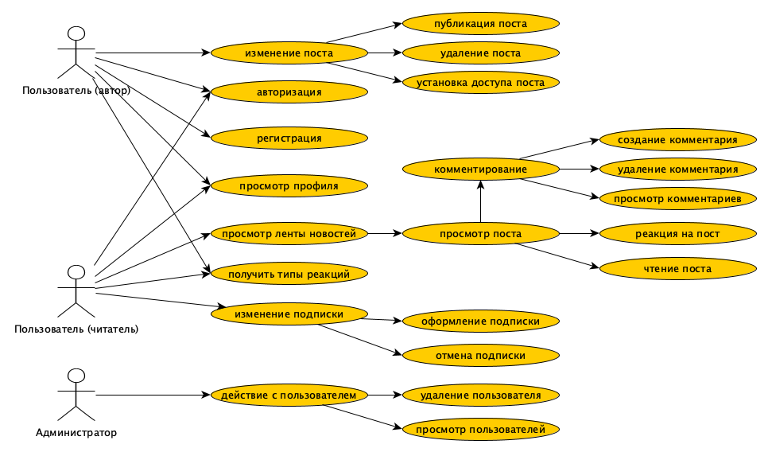

## ER-диаграмма сущностей
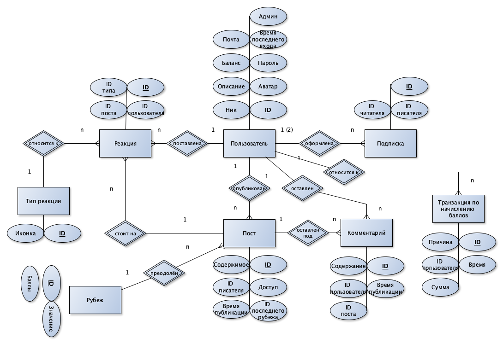

## Пользовательские сценарии
Пользователь, как автор, может зайти в профиль, нажать кнопку добавления поста
и создать новый пост, заполнив его содержимое (соблюдая формат .md) и установив
режим доступа (свободный или по подписке). Также, он может отредактировать уже
созданные посты (в течение любого времени с момента публикации), нажав на кнопку
редактирования (возможности аналогичны возможностям при создании поста). Пост 
можно удалить из профиля безвозвратно, нажав на кнопку удаления поста. 

Пользователь, и как автор и как читатель, может выполнять действия с профилем.
При регистрации создаётся профиль, для которого нужно указать ник (ограничение в 30 символов), краткое 
описание (ограничение в 150 символов), цену подписки (0 == бесплатная), аватар,
пароль (минимум 8 символов) и адрес электронной почты. Профиль можно редактировать или удалить.

Пользователь, как читатель, может просматривать посты в ленте новостей или
зайдя на конкретный профиль. Пост можно просто прочитать или оставить реакцию
(1 из доступных по нажатию на кнопку реакции). Также, можно изменять подписки,
нажимая кнопку подписки или отмены подписки в конкретном профиле или списке 
активных подписок.

Администратор может выполнять все действия с пользователями: создавать, 
редактировать, удалять, просматривать список всех пользователей.

## Сложные сценарии
### Формирование ленты новостей
Лента формируется на основе выборки самых популярных (с наибольшим количеством "лайков") постов всех пользователей на данный
момент (меняется при обновлении сайта/входе). Изначально лента формируется на основе только
бесплатных постов. При оформлении подписок в ленте пользователя будут появляться платные
посты. Первыми в ленте будут появляться последние посты от подписок,
а затем самые популярные посты по общему алгоритму.

### Изменение баланса баллов
Пользователь получает бонус за первый вход ежедневно. Сумма начисления фиксирована каждый день.
Бонусы также можно получить преодолевая "рубежи" популярности (определённое количество лайков,
которое необходимо набрать). Бонусы за популярность также начисляются каждый день при первом входе.
При расчёте учитываются "рубежи" относительно каждого поста пользователя, опубликованного в течение последнего месяца. Списание баллов происходит
при нажатии на кнопку подписки на пользователя, если баланс позволяет оформить данную подписку.

## Формализация бизнес-правил
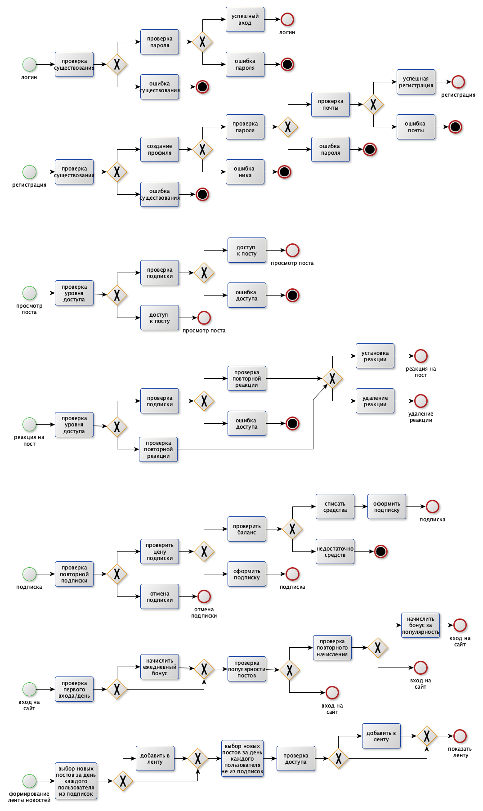

## Описание типа приложения и выбранного технологического стека
**Тип:** Web SPA

**Стек**: 
- Бэк: Golang
- Фронт: VueJS
- БД: PostgreSQL

## Верхнеуровневое разбиение на компоненты
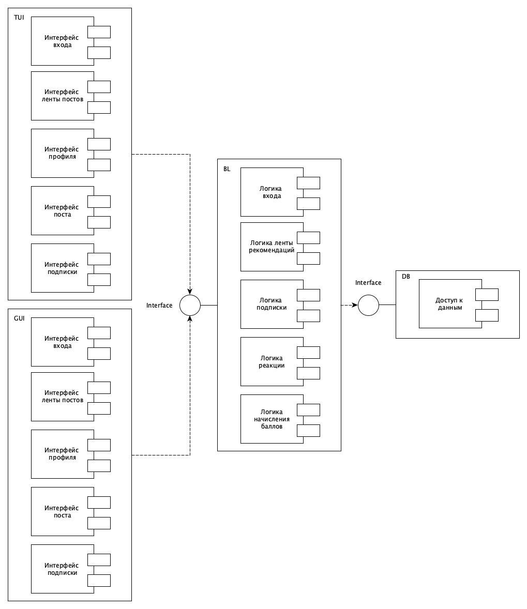

## UML диаграммы классов для двух отдельных компонентов - компонента доступа к данным и компонента с бизнес-логикой
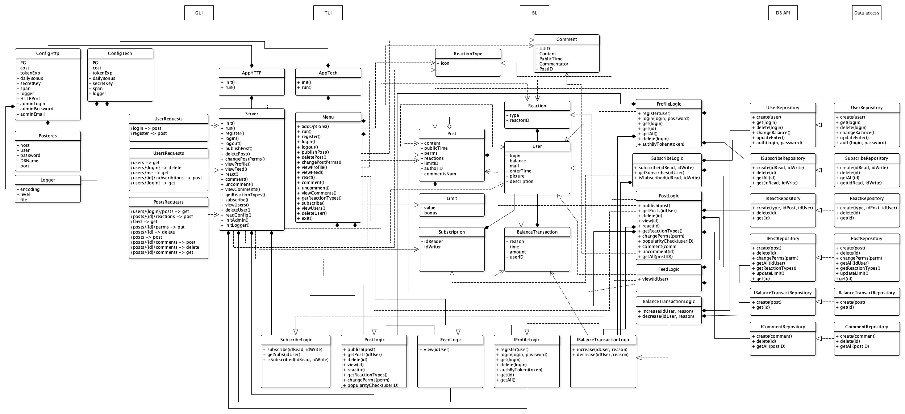

## ER-диаграмма базы данных
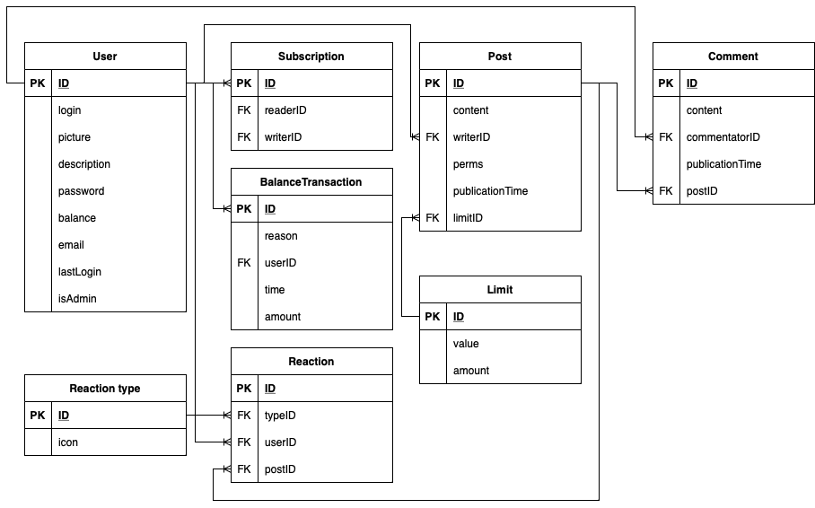

## Экраны web-приложения

### Экран регистрации
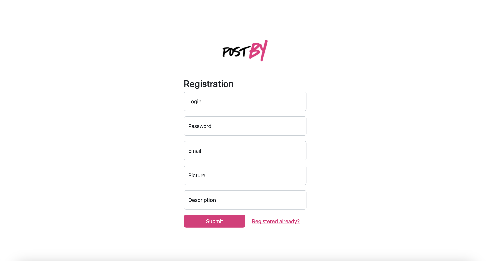

### Экран логина
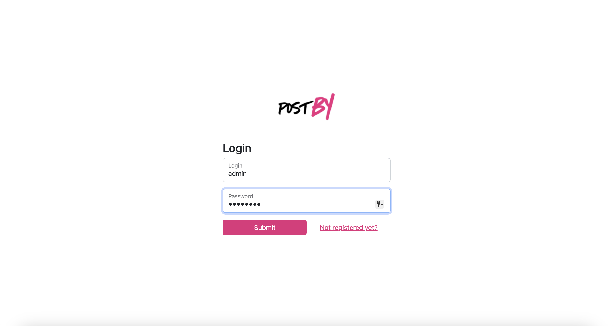

### Экран ленты постов
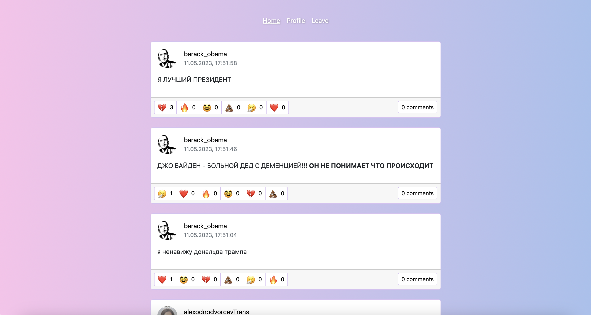

### Экран профиля
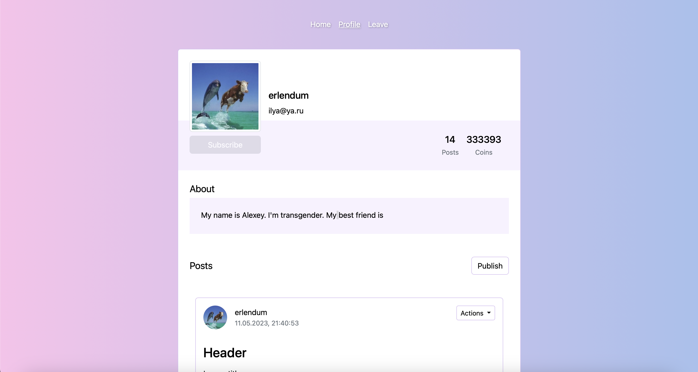

### Экран списка пользоваталей (для администратора)
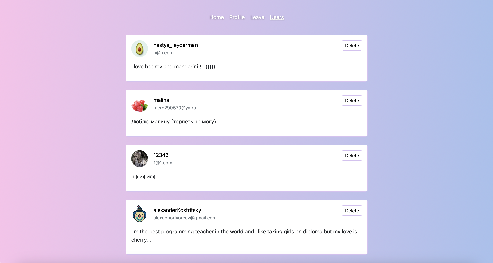

## Ссылка на Figma
https://www.figma.com/file/6dEzLvO7uZOJOmYswhppSs/postby?type=design&node-id=4-19&mode=design&t=jGRnqEop6XitW1wy-0
